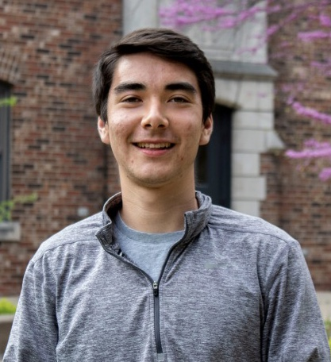

::: {.floatting}

```{r out.width='27%', out.extra='style="float:left; padding:0px; border:3px solid"', include=F}
knitr::include_graphics("https://yangjasp-personalsite.netlify.app/docs/images/jasperphoto.jpg")
```



My name is Jasper Yang and I am an undergraduate at Grinnell College majoring in biology with a concentration in statistics. I am currently taking a year off from school to work as a research assistant in the Department of Biostatistics, Epidemiology, and Informatics at the University of Pennsylvania's Perelman School of Medicine. I hope to pursue a graduate degree in biostatistics after completing my undergraduate studies at Grinnell. 

:::

```{r, include = F, echo = F,out.width= "25%", out.extra='style="float:right; padding:3px"'}
library(jpeg)
jj <- jpeg::readJPEG("/Users/jasper/Desktop/SummerWork2020/distill_site/docs/images/jasperphoto.jpg",native=TRUE)
plot(0:1,0:1,type="n",ann=FALSE,axes=FALSE)
rasterImage(jj,0,0,1,1)
```

My primary research interests are in survey sampling, electronic health records (EHR), and environmental health. I am also interested in applications of statistics in ecology, particularly as it relates to health, including the ecology of infectious disease and conservation ecology. I am currently working on projects analyzing the determinants of COVID-19 hospital outcomes and developing software for efficient multi-wave sampling under two-phase designs. Outside of statistics, I enjoy playing any sport from soccer to baseball, travelling, and biking. I am a diehard Boston sports fan, and I like to say that my love for statistics grew out of studying Major League Baseball statistics as a kid.

This website contains my personal blog, where I occasionally post about interesting applications of statistics in science, sports, and more. Hopefully, it will have some links to published research that I have contributed to soon! 

You can reach me on twitter @jyang29 or via email at yangjasp@grinnell.edu. Thanks for visiting!


