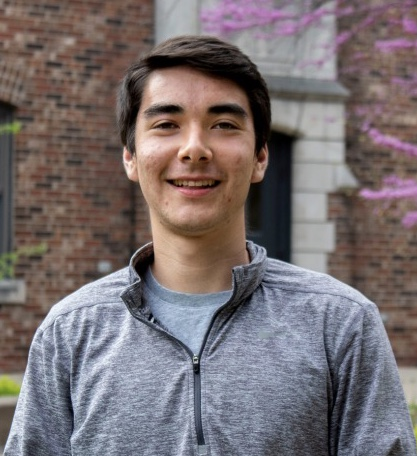

::: {.floatting}

```{r out.width='27%', out.extra='style="float:left; padding:0px; border:3px solid"', include=F}
knitr::include_graphics("https://yangjasp-personalsite.netlify.app/docs/images/jasperphoto.jpg")
```



My name is Jasper Yang and I recently graduated from Grinnell College where I studied biology and statistics. I am currently working as a research assistant at Kaiser Permanente Washington Health Research Institute and hope to pursue a graduate degree in biostatistics soon.

:::

```{r, include = F, echo = F,out.width= "25%", out.extra='style="float:right; padding:3px"'}
library(jpeg)
jj <- jpeg::readJPEG("/Users/jasper/Desktop/SummerWork2020/distill_site/docs/images/jasperphoto.jpg",native=TRUE)
plot(0:1,0:1,type="n",ann=FALSE,axes=FALSE)
rasterImage(jj,0,0,1,1)
```

My primary research interests are in electronic health records (EHR), Bayesian inference, comparitive effectiveness, and health policy. I am also interested in rationality, decision theory, and the philosophy of science, which are all intertwined with principles of statistics. My recent research projects included an analysis of the determinants of COVID-19 hospital outcomes in the University of Pennsylvania Health System and the development of software for efficient multi-wave sampling under two-phase designs. Outside of the classroom, I enjoy playing any sport from soccer to baseball, travelling, and biking. I am a diehard Boston sports fan, and I like to say that my love for statistics grew out of studying Major League Baseball statistics as a kid.

This website contains my personal blog, where I occasionally post about interesting applications of statistics in science, philosophy, sports, and more. Hopefully, it will have some links to published research that I have contributed to soon! 

You can reach me on twitter @jyang29 or via email at yangjasp@grinnell.edu. Thanks for visiting!


